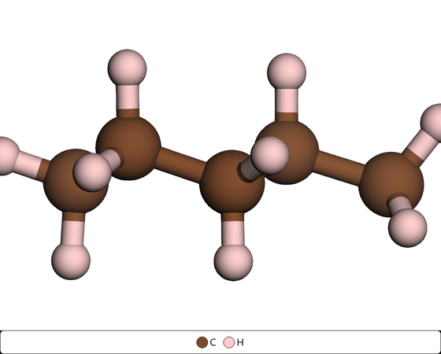

<div align="center">

# CONTCAR → 旋转 GIF 工作台

**把 VASP 的 CONTCAR 结构一键做成可交互预览、可导出分享的旋转 GIF 动图**

[](LICENSE)
[](https://www.python.org/)
[](https://pypi.org/project/PySide6/)
[](https://3dmol.csb.pitt.edu/)
[](https://playwright.dev/)
[](#)



*↑ 正视图绕晶胞 c 轴旋转 360°（正交投影，远近同大）*

</div>

---

> **小提示**：本仓库是 [`XDAT-gif`](https://github.com/moyulyy)（XDATCAR 轨迹工作台）的 CONTCAR 精简版。
> **只读取 `CONTCAR` 一个文件**：不读 `OUTCAR` / `OSZICAR` / `XDATCAR`，不做曲线分析，
> 只专注「结构 → 旋转 GIF」这条链路，同时保留完整图形界面。

## ✨ 功能特性

| | 功能 |
|---|---|
| 🖥️ | **iOS / macOS 风格 GUI**（PySide6）：无边框自绘窗口、红黄绿交通灯、深浅主题 |
| 🧊 | **内嵌 3Dmol.js 交互 3D 窗口**：拖动旋转、滚轮缩放，先「看」再出图 |
| 🎥 | **一键生成旋转 GIF**：绕晶胞 `a/b/c` 轴或屏幕竖直/水平匀速旋转 |
| 🔄 | **无缝循环**：整圈按 `k/n` 采样，首尾不重复，GIF 循环无停顿 |
| 📐 | **正交投影（orthographic）**：远近同大，没有「近大远小」，旋转时模型大小恒定 |
| 🧭 | **六个标准视角**：正视 / 后视 / 俯视 / 仰视 / 右视 / 左视，基于**实际晶胞矢量**计算，三斜/单斜也正确 |
| 📸 | **捕获视角 A**：把 3D 窗口里满意的角度存下来作为 GIF 基准方向 |
| 🎨 | **完整周期表元素配色**：118 种元素逐元素改颜色 / ball 直径（内置 VESTA 经典配色） |
| 🎛️ | **GIF 参数齐全**：画布宽高、帧率、色彩数、高清倍率、乒乓循环、循环播放、保留逐帧 PNG |
| 📊 | **进度弹窗 + GIF 预览页**：生成过程可见、可取消；预览支持滚轮缩放 / 拖动 / 双击复位 |
| 📦 | **可打包便携 exe**：免安装、无需 Python，拷到别的 Windows 电脑即可运行 |
| 🌐 | **离线可用**：本地 3Dmol.js；渲染用系统自带 Edge/Chrome，无需额外浏览器 |

## 📂 目录结构

```
CONT-gif/
├─ contcar_gif_gui.py     # ★ GUI 主程序 (PySide6, iOS 风格)
├─ contcar_to_gif.py      # ★ 渲染核心 (CONTCAR -> 旋转 GIF, 也可当命令行用)
├─ viewer3d.py            # ★ 内嵌交互式 3D 结构浏览器 (QWebEngineView)
├─ ui_kit.py              # ★ iOS 风格 Qt 控件 (卡片/开关/分段控件/滑块)
├─ 3dmol/3Dmol-min.js     # ★ 本地 3Dmol.js (离线可用)
├─ assets/app.ico         # ★ 应用图标
├─ make_icon.py           # 重新生成图标 (可选)
├─ samples/CONTCAR        # 测试用样例结构 (H/C/O/Co/Ni, 193 原子)
├─ docs/demo.gif          # README 演示动图
├─ requirements.txt       # ★ Python 依赖清单
├─ install_deps.bat       # ★ 一键安装依赖 (双击)
├─ run_gui.bat            # 双击启动 GUI (无控制台)
├─ run_gui_debug.bat      # 双击启动 GUI (保留控制台, 看报错)
├─ run_gif.bat            # 双击用命令行核心生成 CONTCAR.gif
├─ build_exe.bat          # 双击打包 (默认便携文件夹)
├─ CONTCAR_GIF.spec       # PyInstaller 打包配置
└─ dist/                  # 打包产物 (未入库, 自行 build)
```

## 🚀 快速开始

### 1. 安装依赖（三选一）

```bat
:: ① 双击 install_deps.bat（推荐）

:: ② 命令行
D:\miniconda3\envs\chem_env\python.exe -m pip install -r requirements.txt

:: ③ 手动
D:\miniconda3\envs\chem_env\python.exe -m pip install ase numpy pillow playwright PySide6
```

> 需要系统自带 **Edge**（Win10/11 默认都有）或 Chrome；都没有时执行
> `python -m playwright install chromium`。

### 2. 启动

```bat
:: 图形界面（默认小窗口居中，不铺满屏幕）
run_gui.bat

:: 命令行：CONTCAR -> CONTCAR.gif
run_gif.bat
```

### 3. 使用流程

1. **结构浏览**页：点「选择 CONTCAR」→「开始加载」，3D 窗口显示结构。
   - 拖动旋转 / 滚轮缩放；右栏可切**预设视角**、调缩放/平移。
   - 想用自定义方向：拖到满意角度 → 点「设为视角 A」→ 右栏「视角模式」选 **捕获视角 A**。
   - 设置 **旋转轴**（默认 c 轴）、**旋转角度**（默认 360°）、**旋转帧数**（默认 60）。
   - 「元素配色…」打开完整周期表，逐元素改颜色 / ball 直径。
2. **GIF 设置**页：输出文件、画布宽高、帧率、颜色数、高清倍率、乒乓/循环、保留 PNG；
   可点「预览单帧」检查一帧。
3. 点右上角 **「生成 GIF」**，弹出进度弹窗；完成后自动跳到 **GIF 预览**页。

## 💻 命令行用法

`contcar_to_gif.py` 与 GUI 共用同一套渲染核心：

```bat
rem 默认: 绕 c 轴旋转 360°, 60 帧, 输出 CONTCAR.gif
D:\miniconda3\envs\chem_env\python.exe contcar_to_gif.py

rem 正视图 + 绕 c 轴转一圈, 90 帧, 20 fps, 900x900
D:\miniconda3\envs\chem_env\python.exe contcar_to_gif.py ^
    -f samples\CONTCAR -o spin.gif --view front --rot-axis c --rot-angle 360 ^
    --frames 90 --fps 20 -w 900 --height 900

rem 俯视图 + 绕 a 轴半圈; 球模型; 黑背景; 2 倍超采样
D:\miniconda3\envs\chem_env\python.exe contcar_to_gif.py --view top --rot-axis a ^
    --rot-angle 180 --style sphere --bg black --scale 2
```

<details>
<summary><b>全部参数（点击展开）</b></summary>

| 参数 | 默认 | 说明 |
|------|------|------|
| `-f, --file` | `CONTCAR` | 输入结构文件 |
| `-o, --out` | `CONTCAR.gif` | 输出文件（`.png` 则只存单帧） |
| `--frames` | `60` | 旋转帧数 |
| `--view` | `front` | 基准视角 `front/back/top/bottom/right/left` |
| `--rot-axis` | `c` | 旋转轴 `a/b/c` 或 `screen-v/screen-h` |
| `--rot-angle` | `360` | 整段旋转总角度（度） |
| `--fps` | `20` | GIF 帧率 |
| `-w, --width` | `600` | 画布宽（像素） |
| `--height` | 同宽 | 画布高（像素） |
| `--scale` | `1.0` | 超采样倍率（2 更清晰） |
| `--zoom` | `1.25` | 缩放 |
| `--style` | `ballstick` | `ballstick/sphere/stick/line` |
| `--radius-scale` | `0.6` | 原子半径缩放 |
| `--radius` | 无 | 统一原子球半径 |
| `--bg` | `white` | 背景色 |
| `--cell / --no-cell` | 显示 | 晶胞框 |
| `--colors` | `256` | GIF 调色板颜色数 |
| `--pingpong` | 关 | 正放 + 倒放 |
| `--loop` | `0` | 循环次数（0 = 无限） |
| `--keep-frames` | 关 | 保留逐帧 PNG |

</details>

## 🔬 工作原理

```
CONTCAR ──ASE(vasp)──► 单个 Atoms
                          │ build_frames(): 复制成 N 帧 (结构不变)
                          ▼
              view_quaternion(cell) 计算基准视角 (六个标准视角)
                          │ rotation_views() 绕晶胞轴逐帧旋转
                          ▼
            3Dmol.js (浏览器 WebGL) 逐帧渲染 (正交投影)
                          │ Playwright 截取 PNG
                          ▼
             Pillow 自适应调色板 → 旋转 GIF (默认无限循环)
```

**几个关键设计**

- **旋转**：`R(i) = R_基准 · R_轴(角度_i)`，发生在模型自身坐标系里 —— 转轴始终是你指定的
  那根晶胞轴，投影到屏幕上方向不变，不会「转轴在屏幕上乱跑」。
- **无缝循环**：总角度是 360° 整数倍时按 `k/n` 取样（0, 360/n, …, (n-1)·360/n），
  **不重复首帧**；其它角度（如 180°）按 `k/(n-1)` 取样，最后一张正好到达目标角度。
- **正交投影**：正交视锥半高 = `包围球半径 / 缩放`，与相机距离无关，因此旋转时模型大小恒定。
  3Dmol 的 `show()` 会按 `right = distance·tan(fov)` 重算投影，所以缩放由**相机距离**驱动。
- **取景**：用覆盖「原子 + 晶胞盒」的包围球，结构始终居中且完整，不受画布尺寸影响。
- **配色**：内置 VESTA 经典配色，不需要任何外部 `.vesta` 文件。

## 📦 打包成便携免安装 exe

双击 **`build_exe.bat`**（默认生成**便携文件夹**，推荐）：

```
dist\CONTCAR_GIF\
  CONTCAR_GIF.exe      <- 双击即用
  _internal\           <- 依赖 (Qt / WebEngine / playwright / ase / 3Dmol.js / 图标 / 样例)
```

把整个 `CONTCAR_GIF` 文件夹拷到任何 Windows 10/11 机器上双击即可运行，**免安装、无需 Python**。

<details>
<summary><b>单文件 exe / 打包后自检</b></summary>

```bat
:: 单文件 (一个文件, 启动需解包到 %TEMP%, 较慢)
set CONT_ONEFILE=1
build_exe.bat
:: 产物: dist\CONTCAR_GIF.exe

:: 自检 (真正跑通 读取 CONTCAR -> 3Dmol 渲染 -> 合成 GIF)
dist\CONTCAR_GIF\CONTCAR_GIF.exe --selftest "%CD%\dist\CONTCAR_GIF\_internal\samples\CONTCAR" "%TEMP%\t.gif" 3
```

结果写入 `<输出>.log`，结尾为 `SELFTEST OK`（退出码 0）。

</details>

## ❓常见问题

1. **双击 bat 闪退** → 用 `run_gui_debug.bat` 看报错；致命错误也会写入 `gui_error.log`。
2. **无法启动浏览器** → 安装 Edge/Chrome，或 `python -m playwright install chromium`。
3. **3D 窗口黑屏** → 更新显卡驱动；确认没有给其父控件加阴影特效（程序已规避）。
4. **GIF 太大** → 减小旋转帧数 / 画布尺寸 / 颜色数。
5. **想更清晰** → 调大画布宽高，并把「高清倍率」设为 2。

## 📄 License

本项目基于 [MIT License](LICENSE) 开源。

<div align="center"><sub>如果这个项目对你有帮助，欢迎点个 ⭐ Star ~</sub></div>
